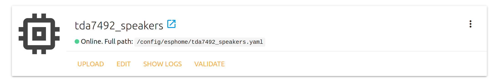

# Звуковые оповещения на Raspberry Pi c Home Assistant или без него :radio:  
После того, как в буквальном смысле нашел старые колонки [Radiotehnika S-30A](http://ldsound.ru/radiotehnika-s-30a/) было решено сделать голосовые оповещения для своего умного дома. Для того, чтобы запитать колонки необходим усилитель - выбрал [2 x 50W TDA7492 Class D High-Power Digital Amplifier Board](https://www.aliexpress.com/item/33025736088.html), потому что я не меломан, а для работы колонок вполне хватает.

Сначала использовал отдельную Raspberry Pi 1 с [Volumio](https://volumio.org/), все отлично работало, но после обновления  Volumio летом 2019 года что-то сломалось и пришлось использовать другой образ - [Pi MusicBox](https://www.pimusicbox.com/). Такую связку можно использовать и без домашней автоматизации.

Дальше решил переехать на ту же Raspberry Pi, на которой установлен Hass.io. Долго не мог подобрать подходящее дополнение, но в итого был найден [Mopidy addon for hass.io](https://github.com/assada/hassio-addons/tree/master/mopidy).

Поскольку колонки используюся только для голосовых оповещений обнаружилось что в режиме ожидания они шипят - возможно провод некачественный, усилитель не самый лучший или, что более вероятно, из-за того что НЕ используется [DAC+ ADC](https://www.hifiberry.com/shop/). В любом случае решением стало реле [Sonoff SV](https://www.itead.cc/ru/sonoff-sv.html), подающее напряжение на усилитель до начала объявления и обесточивающее усилитель после.

# Прошивка ESPHome для реле
Использую [ESPHome Hass.io Add-On](https://github.com/esphome/hassio) для компиляции и выбрал конкретно эту прошивку из-за элементарной интеграции в Home Assistant:

[tda7492_speakers.yaml](tda7492_speakers.yaml)

# Голосовые оповещения из Home Assistant
В [automations.yaml](automations.yaml) представлены различные правила для голосовых оповещений, а в [configuration.yaml](configuration.yaml) - настройки бесплатного Text to Speech (TTS). Образец звука в [ced7f955cfb440b12c419befd25ffa7fd7854989_ru_-_google_translate.mp3](ced7f955cfb440b12c419befd25ffa7fd7854989_ru_-_google_translate.mp3).

# Фотографии
