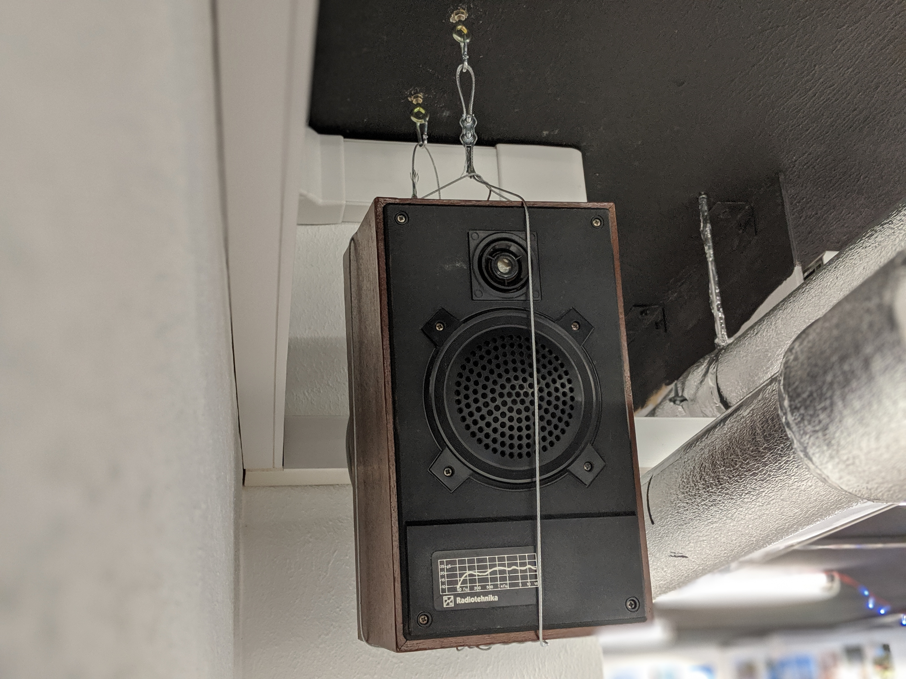
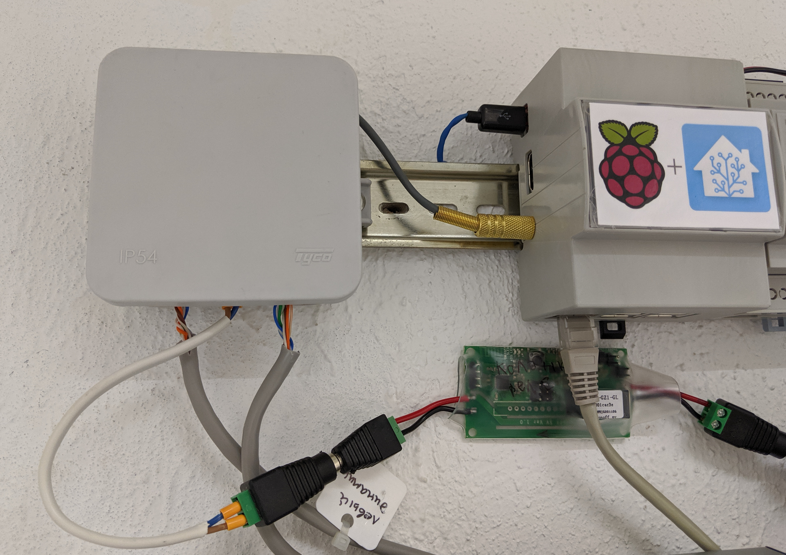

# Sound alerts on the Raspberry Pi :radio:  

Together with or without Home Assistant.

Read this in other languages: [English](README.md), [Русский язык](README.ru.md).

______________

After I literally found the old speakers, it was decided that I make voice alerts for my smart home. In order to power the speakers, an amplifier is needed - I chose the [2 x 50W TDA7492 Class D High-Power Digital Amplifier Board](https://www.aliexpress.com/item/33025736088.html). I am not a music lover, and for the operation of my speakers, this amplifier is enough.

At first, I used a separate Raspberry Pi 1 with [Volumio](https://volumio.org/). Everything worked fine, but after updating Volumio in the summer of 2019, something broke and I had to use another image - [Pi MusicBox](https://www.pimusicbox.com/). Such a bunch can be used without home automation.

Then, I decided to use it on the same Raspberry Pi on which Hass.io is installed. For a long time, I could not find a suitable addition, but eventually, the [Mopidy addon for hass.io](https://github.com/assada/hassio-addons/tree/master/mopidy) for hass.io was found.

Since the speakers are used only for voice alerts, it was found that they hiss in standby mode - perhaps the wire is of poor quality, the amplifier is not the best, or, more likely, because it does NOT use [DAC+ ADC](https://www.hifiberry.com/shop/). In any case, the solution was the [Sonoff SV](https://www.itead.cc/ru/sonoff-sv.html) relay, which supplies voltage to the amplifier before the announcement, and de-energizes the amplifier after.

# ESPHome firmware for relay
I use the [ESPHome Hass.io Add-On](https://github.com/esphome/hassio) to compile yaml. I chose this firmware specifically because of the elementary integration in the Home Assistant:

[tda7492_speakers.yaml](tda7492_speakers.yaml)

# Voice alerts from Home Assistant
In [automations.yaml](automations.yaml), there are various rules for voice alerts, and in [configuration.yaml](configuration.yaml) - settings for free Text to Speech (TTS). Sample sound (RU) in the file: [ced7f955cfb440b12c419befd25ffa7fd7854989_ru_-_google_translate.mp3](ced7f955cfb440b12c419befd25ffa7fd7854989_ru_-_google_translate.mp3).

# Photos

